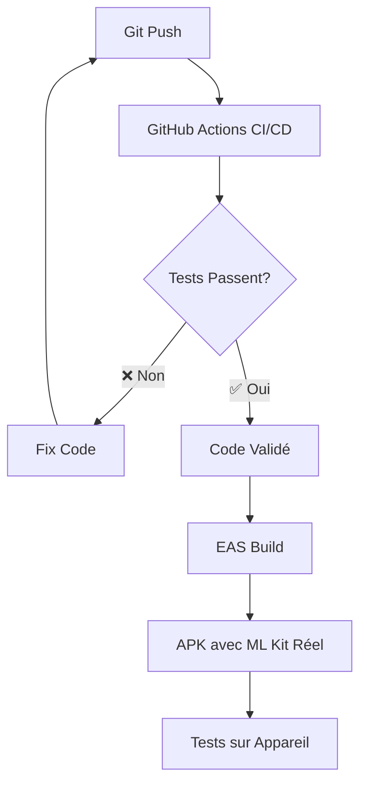

# 🤖 Guide ML Kit et EAS Build - EcoTri

## 📋 Vue d'ensemble

Ce guide détaille l'implémentation de ML Kit on-device et l'utilisation d'EAS Build pour créer des versions natives de l'application EcoTri avec reconnaissance d'images.

## 🎯 Pourquoi ML Kit On-Device ?

### Avantages

- ✅ **100% Gratuit** - Contrairement à Google Cloud Vision API
- ✅ **Confidentialité** - Traitement local, pas de données envoyées au cloud
- ✅ **Performance** - Analyse rapide directement sur l'appareil
- ✅ **Hors ligne** - Fonctionne sans connexion internet
- ✅ **Intégration native** - Optimisé pour React Native

### Comparaison des solutions

| Solution             | Coût    | Confidentialité | Performance | Hors ligne |
| -------------------- | ------- | --------------- | ----------- | ---------- |
| **ML Kit On-Device** | Gratuit | ✅ Locale       | ✅ Rapide   | ✅ Oui     |
| Google Cloud Vision  | Payant  | ❌ Cloud        | ⚠️ Réseau   | ❌ Non     |
| Simulation locale    | Gratuit | ✅ Locale       | ✅ Rapide   | ✅ Oui     |

## 🏗️ Architecture ML Kit

### Structure du service

```typescript
// src/services/mlKitService.ts
import ImageLabeling from '@react-native-ml-kit/image-labeling';

export class MLKitService {
  /**
   * Analyse une image avec ML Kit on-device
   * Fallback vers simulation si ML Kit non disponible
   */
  async analyzeImage(imageUri: string): Promise<AnalysisResult> {
    try {
      // Tentative d'utilisation du vrai ML Kit
      const labels = await ImageLabeling.label(imageUri);
      console.log('🤖 ML Kit réel utilisé');
      return this.processRealLabels(labels);
    } catch (error) {
      // Fallback vers simulation
      console.log('🎭 Fallback vers simulation ML Kit');
      return this.fallbackSimulation();
    }
  }

  /**
   * Traite les labels du vrai ML Kit
   */
  private processRealLabels(labels: ImageLabel[]): AnalysisResult {
    const primaryLabel = labels[0]?.text || 'Unknown';
    const wasteCategory = this.classifyWaste([primaryLabel]);

    return {
      labels: labels.map(label => label.text),
      objects: this.generateObjectsFromLabels(labels),
      wasteCategory,
      confidence: labels[0]?.confidence || 0.5,
      isSimulation: false,
    };
  }

  /**
   * Simulation intelligente si ML Kit non disponible
   */
  private fallbackSimulation(): AnalysisResult {
    const simulatedLabels = this.generateSimulatedLabels();
    const wasteCategory = this.classifyWaste(simulatedLabels);

    return {
      labels: simulatedLabels,
      objects: this.generateSimulatedObjects(simulatedLabels),
      wasteCategory,
      confidence: Math.random() * 0.3 + 0.7, // 70-100%
      isSimulation: true,
    };
  }
}
```

### Classification des déchets

```typescript
/**
 * Mapping des labels ML Kit vers catégories de déchets
 */
private classifyWaste(labels: string[]): WasteCategory {
  const primaryLabel = labels[0]?.toLowerCase() || '';

  // Mapping direct label → catégorie
  const categoryMap: Record<string, WasteCategory> = {
    'bottle': 'Plastique',
    'plastic': 'Plastique',
    'can': 'Métal',
    'metal': 'Métal',
    'paper': 'Papier',
    'document': 'Papier',
    'glass': 'Verre',
    'jar': 'Verre',
    'cardboard': 'Carton',
    'box': 'Carton'
  };

  return categoryMap[primaryLabel] || 'Autre';
}
```

## 🚀 EAS Build Configuration

### Pourquoi EAS Build ? (vs GitHub Actions CI/CD)

**🤔 Question fréquente :** "Pourquoi utiliser EAS Build si j'ai déjà GitHub Actions ?"

#### **GitHub Actions CI/CD** (Tests et Qualité)

```yaml
# .github/workflows/ci.yml - Ce que vous avez déjà
✅ Linting du code (eslint)
✅ Tests unitaires (jest)
✅ Type checking (typescript)
✅ Validation Expo (expo-doctor)
❌ Pas de build natif (pas d'APK/IPA)
❌ Pas de modules natifs (ML Kit ne fonctionne pas)
❌ Expo Go seulement (simulation uniquement)
```

#### **EAS Build** (Compilation Native)

```yaml
# EAS Build - Ce dont vous avez besoin pour ML Kit
✅ Compilation Android/iOS native
✅ Support modules natifs (@react-native-ml-kit/image-labeling)
✅ Génération APK/IPA réels
✅ expo-dev-client avec rechargement à chaud
❌ Plus lent (10-15 min vs 2-3 min)
❌ Limité (30 builds/mois gratuits)
```

#### **Workflow Recommandé - Les Deux Ensemble**



**Utilisation optimale :**

1. **Développement quotidien** : GitHub Actions (rapide, gratuit)
2. **Tests fonctionnels** : EAS Build (ML Kit réel, économiser les builds)
3. **Release** : GitHub Actions ✅ → EAS Build → App Store

**Problèmes des builds locaux :**

- Configuration complexe Android SDK/Xcode
- Problèmes de chemins Windows
- Erreurs de modules natifs (react-native-reanimated)
- Maintenance des environnements de build

**Solutions EAS Build :**

- ✅ Environnement cloud optimisé
- ✅ Support complet modules natifs
- ✅ Pas de configuration locale
- ✅ 30 builds/mois gratuits

### Configuration eas.json

```json
{
  "cli": {
    "version": ">= 5.2.0"
  },
  "build": {
    "development": {
      "developmentClient": true,
      "distribution": "internal",
      "android": {
        "buildType": "apk",
        "gradleCommand": ":app:assembleDebug"
      },
      "ios": {
        "buildConfiguration": "Debug"
      }
    },
    "preview": {
      "distribution": "internal",
      "android": {
        "buildType": "apk"
      }
    },
    "production": {
      "distribution": "store",
      "android": {
        "buildType": "aab"
      }
    }
  },
  "submit": {
    "production": {}
  }
}
```

### Workflow EAS Build

```bash
# 1. Installation et configuration
npm install -g @expo/cli
npx expo register  # Créer compte Expo
npx expo login     # Se connecter

# 2. Configuration du projet
npx eas build:configure

# 3. Build de développement avec ML Kit
npx eas build --platform android --profile development

# 4. Suivi du build
# → Lien fourni vers https://expo.dev
# → Téléchargement APK une fois terminé

# 5. Installation sur appareil
# → Télécharger APK depuis le lien
# → Installer manuellement (autoriser sources inconnues)
# → Lancer l'app avec ML Kit activé
```

## 📱 Installation et Test

### Prérequis appareil Android

1. **Mode développeur activé**
   - Paramètres → À propos → Taper 7x sur "Numéro de build"

2. **Sources inconnues autorisées**
   - Paramètres → Sécurité → Autoriser sources inconnues

3. **Connexion au même réseau WiFi**
   - Pour le rechargement à chaud (dev client)

### Installation de l'APK

```bash
# Méthode 1: Téléchargement direct
# → Ouvrir le lien EAS Build sur le téléphone
# → Télécharger et installer l'APK

# Méthode 2: ADB (si connecté)
adb install app-debug.apk

# Méthode 3: Transfert manuel
# → Copier APK sur téléphone
# → Ouvrir avec gestionnaire de fichiers
# → Installer
```

### Vérification ML Kit

Une fois l'app installée :

1. **Lancer l'application**
2. **Aller sur l'écran Scan**
3. **Prendre une photo d'objet**
4. **Vérifier les logs** :
   ```
   🤖 ML Kit réel utilisé    // ✅ ML Kit fonctionne
   🎭 Fallback vers simulation // ⚠️ ML Kit non disponible
   ```

## 🎮 Gamification et Statistiques

### Système de points

```typescript
// src/services/storageService.ts
export const saveScanStats = async (
  category: string,
  isSimulation: boolean = false
): Promise<void> => {
  const points = isSimulation ? 5 : 10; // Moins de points pour simulation

  await updateUserStats({
    scansCompleted: 1,
    points: points,
    categoriesScanned: [category],
  });
};
```

### Persistance locale

```typescript
// Sauvegarde AsyncStorage + Firestore
const updateUserStats = async (newStats: Partial<UserStats>) => {
  try {
    // 1. Récupérer stats actuelles
    const currentStats = await AsyncStorage.getItem('userStats');
    const stats = currentStats ? JSON.parse(currentStats) : DEFAULT_STATS;

    // 2. Mettre à jour localement
    const updatedStats = {
      ...stats,
      scansCompleted: stats.scansCompleted + (newStats.scansCompleted || 0),
      points: stats.points + (newStats.points || 0),
      // ... autres champs
    };

    // 3. Sauvegarder localement
    await AsyncStorage.setItem('userStats', JSON.stringify(updatedStats));

    // 4. Optionnel: Sync Firestore
    if (auth.currentUser) {
      await syncToFirestore(updatedStats);
    }
  } catch (error) {
    console.error('Erreur sauvegarde stats:', error);
  }
};
```

## 🔧 Dépannage

### Problèmes courants

#### 1. ML Kit ne fonctionne pas

**Symptômes :**

- Toujours "🎭 Fallback vers simulation"
- Erreur "package doesn't seem to be linked"

**Solutions :**

- Vérifier que l'APK a été généré avec EAS Build
- S'assurer que `expo-dev-client` est installé
- Redémarrer l'application

#### 2. Build EAS échoue

**Symptômes :**

- Erreur lors du build cloud
- "Build failed with exit code 1"

**Solutions :**

```bash
# Nettoyer et reconfigurer
rm -rf node_modules package-lock.json
npm install
npx eas build:configure
npx eas build --platform android --profile development --clear-cache
```

#### 3. APK ne s'installe pas

**Symptômes :**

- "Application non installée"
- Erreur de signature

**Solutions :**

- Vérifier que les sources inconnues sont autorisées
- Désinstaller version précédente si nécessaire
- Vérifier l'espace disque disponible

#### 4. Stats ne se sauvegardent pas

**Symptômes :**

- Profil affiche toujours 0 scans
- Points ne s'accumulent pas

**Solutions :**

- Vérifier AsyncStorage avec le bouton refresh
- Vérifier les permissions Firestore
- Consulter les logs de la console

### Logs utiles

```typescript
// Activer logs détaillés
console.log('🤖 Tentative ML Kit:', imageUri);
console.log('📊 Stats avant:', currentStats);
console.log('💾 Sauvegarde:', updatedStats);
console.log('🔄 Sync Firestore:', success);
```

## 📊 Métriques et Monitoring

### Indicateurs de performance

- **Taux d'utilisation ML Kit réel** vs simulation
- **Temps d'analyse** par image
- **Précision de classification** par catégorie
- **Rétention utilisateur** avec gamification

### Analytics recommandés

```typescript
// Firebase Analytics events
await analytics().logEvent('scan_completed', {
  category: wasteCategory,
  ml_kit_used: !isSimulation,
  confidence: confidence,
  processing_time: processingTime,
});

await analytics().logEvent('gamification_points_earned', {
  points: pointsEarned,
  total_points: totalPoints,
  scan_count: scanCount,
});
```

## 🚀 Roadmap

### Améliorations futures

1. **Custom Models** - Modèles spécialisés déchets
2. **Batch Processing** - Analyse multiple images
3. **Offline Sync** - Synchronisation différée
4. **Advanced Gamification** - Défis et récompenses
5. **Social Features** - Partage et comparaisons

### Optimisations

1. **Cache intelligent** - Réutilisation résultats similaires
2. **Compression images** - Optimisation performance
3. **Background processing** - Analyse asynchrone
4. **Progressive loading** - Interface responsive

---

**Version** : 2.0.0  
**Dernière mise à jour** : Décembre 2024  
**ML Kit Version** : `@react-native-ml-kit/image-labeling@6.0.0`  
**EAS CLI Version** : `>= 5.2.0`
